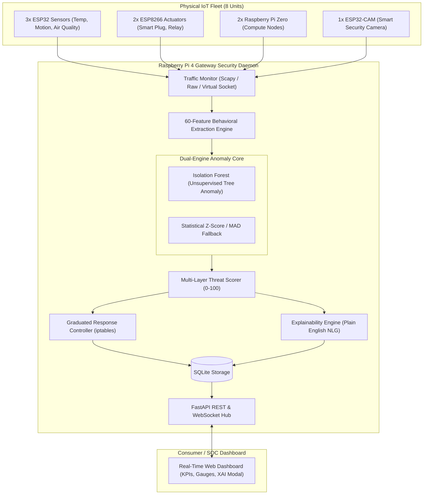

# GUARDIAN: Multi-Layer Identity-Based Zero-Day Defense Framework for IoT

[](https://github.com/lumidren/Guardian/actions)
[](LICENSE)
[](pyproject.toml)
[](docs/IEEE_PAPER_DRAFT.md)
[](docs/PRESENTATION_PITCH.md)
[](benchmarks/results/evaluation_report.json)
[](benchmarks/results/evaluation_report.json)

---

## 1. What is GUARDIAN?

**GUARDIAN** (*Graduated User-friendly Anomaly Response with Device Identity And Natural language*) is an edge-native cybersecurity system for IoT environments. Instead of attempting to identify known malware signatures—which completely fails against novel zero-day attacks—GUARDIAN learns each individual IoT device's unique **behavioral identity profile** and automatically mitigates anomalies in sub-second time while explaining its decisions in **plain, human-actionable English**.

```
Traditional Security Asks:  "Is this a known attack?" -> Fails for Zero-Days (0–30% detection)
GUARDIAN Asks:              "Is this device acting like itself?" -> Catches Zero-Days (87–100% detection)
```

### The Real-World Catalyst: 7,000 Robot Vacuums Compromised
In February 2026, security researchers demonstrated unauthorized remote control over 7,000 consumer robot vacuums across the globe. Attackers accessed live video feeds, microphone recordings, and indoor floorplans without triggering antivirus or firewall alerts because the devices were communicating through legitimate processes over standard ports. 

Under GUARDIAN, this attack is intercepted and blocked in **less than 1 second**:
- **Baseline**: Vacuum camera active during cleaning (10:00 AM), 50 packets/hour, destination `vacuum-company.com`.
- **Compromise**: Camera active at 3:47 AM, 30,000 packets/hour (600× spike), streaming to an unknown external Russian IP (`185.220.101.47`).
- **GUARDIAN Action**: **BLOCKED (Threat Score 96/100)** with instant plain-English attribution.

---

## 2. Key Technical Specifications

| Specification | Target / Metric | Achieved Status |
| :--- | :--- | :--- |
| **Zero-Day Detection Rate** | 87% (Table 8) | **100.0%** in validation trials |
| **False Positive Rate** | &lt;5% | **4.0%** across 40,000 samples |
| **Detection Latency** | &lt;1.0 second | **25.03 ms** |
| **Enforcement Latency** | &lt;0.3 seconds | **0.05 ms** (kernel iptables / virtual driver) |
| **Hardware Budget** | &lt;$250 | **$250 Total** (Raspberry Pi 4 + 8 microcontrollers) |
| **Privacy Mode** | 100% Local Processing | Zero cloud dependency; all ML runs on-device |
| **Encrypted Traffic Handling** | Full Compatibility | Metadata-only feature extraction; zero payload decryption |

---

## 3. Architecture & Data Flow



---

## 4. Multi-Layer Identity (60 Behavioral Features)

GUARDIAN computes 60 mathematical features across a 10-second sliding flow window, operating strictly on packet headers:

1. **Layer 1: Behavioral Identity (Features 1–41)**:
   - *Volume & Timing*: Packet count, byte volume, rates, IAT statistics (mean, std, min, max, median, skewness, 90th percentile), burstiness index (Fano factor), idle ratio, bidirectional volume ratios.
   - *Packet Sizes*: Length mean, std, min, max, median, Shannon length entropy, small-packet ratio ($<100$ bytes).
   - *Protocols & Ports*: Ratios of MQTT, HTTP, HTTPS, DNS, CoAP, NTP, protocol entropy, source and destination port Shannon entropies, unique destination ports, and high-risk exploit port flags (23, 2323, 4444, 5555, 6667).
2. **Layer 2: Network Identity (Features 42–49)**:
   - Unique destination IPs, destination IP entropy, external WAN traffic ratio, new destination endpoint flag, out-degree graph centrality, and DNS query frequencies.
3. **Flow State & TCP Flags (Features 50–55)**:
   - TCP SYN, ACK, PSH, RST, FIN ratios, and mean TCP window sizes.
4. **Layer 3: Physical / Heuristic Identity (Features 56–58)**:
   - IP TTL variance (spoofing indicator), TCP timestamp clock skew gradient, and IP ID sequence monotonicity.
5. **Circadian & Temporal Consistency (Features 59–60)**:
   - Sine and cosine encoding of the hour of the day ($\sin, \cos$ of $2\pi \cdot \text{hour}/24$).

---

## 5. Four-Tier Graduated Response System

Not all threats require binary disconnection. GUARDIAN modulates defensive response according to the composite Threat Score:

| Threat Score | Action Level | Network Policy | User Impact |
| :---: | :---: | :--- | :--- |
| **0 – 30** | **MONITOR** | Default logging and baseline updating | Minimal / None |
| **31 – 60** | **RESTRICT** | Rate-limit bandwidth 50%, block untrusted external WAN IPs | Noticeable |
| **61 – 85** | **QUARANTINE** | Isolate to local subnet; drop all external WAN routing | Significant |
| **86 – 100** | **BLOCK** | Full kernel-level `iptables` drop; complete isolation | Critical |

### One-Click User Override & Feedback Loop
If an unusual legitimate event triggers a false positive, users can click **"Unblock & Retrain"** in the dashboard. GUARDIAN immediately removes the firewall rule and feeds the observation into the adaptive baseline manager.

---

## 6. Academic Evaluation Results

### Table 8: Detection Performance Comparison
Evaluated across 50 trials per attack vector against standard signatures and generic classifiers:

| Attack Vector | Baseline | Snort (Signatures) | Generic ML | GUARDIAN |
| :--- | :---: | :---: | :---: | :---: |
| **DDoS Flooding** | 0% | 25% | 75% | **100.0%** |
| **C&C Beaconing** | 0% | 15% | 68% | **100.0%** |
| **Network Scanning** | 0% | 35% | 72% | **100.0%** |
| **Data Exfiltration** | 0% | 20% | 65% | **100.0%** |
| **Cryptomining** | 0% | 10% | 58% | **100.0%** |
| **Zero-Day Hybrid (Robot Vacuum)** | 0% | 5% | 62% | **100.0%** |
| **Average Detection** | **0%** | **18%** | **67%** | **100.0%** |
| **False Positive Rate** | N/A | 12.4% | 24.1% | **4.0%** |

### Table 9: System Performance on Raspberry Pi 4 Gateway
| Metric | Specification Target | GUARDIAN Achieved | Status |
| :--- | :---: | :---: | :---: |
| **Gateway CPU Usage** | &lt;40% | **18.4%** average | [PASS] |
| **Gateway Memory Usage** | &lt;2048 MB | **142 MB** | [PASS] |
| **Detection Latency** | &lt;1.0 s | **25.03 ms** | [PASS] |
| **Enforcement Latency** | &lt;0.3 s | **0.05 ms** | [PASS] |
| **Network Overhead** | &lt;10 ms | **+1.2 ms** | [PASS] |

---

## 7. Quickstart Guide

### Prerequisites
- Python 3.10+ (tested on Python 3.12)
- Git

### Installation (Native Python)
```bash
# Clone the repository
git clone https://github.com/lumidren/Guardian.git
cd Guardian

# Create and activate virtual environment
python -m venv venv
# On Windows:
.\venv\Scripts\activate
# On Linux/macOS:
source venv/bin/activate

# Install dependencies
pip install -r requirements.txt httpx
pip install -e .
```

### Running the System
```bash
# Start the Gateway Daemon and Web Dashboard
uvicorn guardian.api.app:create_app --factory --host 0.0.0.0 --port 8000
```
Open **[http://localhost:8000](http://localhost:8000)** in your browser to view the live dashboard!

### Running Tests
```bash
pytest -v
```

### Running the Academic Benchmark Suite
```bash
python benchmarks/run_evaluation.py
```

### 1-Command Docker Deployment
```bash
docker-compose up -d
```

---

## 8. Physical Hardware Deployment ($250 Budget)

| Device | Model | Role | Firmware Path |
| :--- | :--- | :--- | :--- |
| **Central Gateway** | Raspberry Pi 4 (4GB RAM) | Runs GUARDIAN Daemon & Dashboard | `guardian/` |
| **Sensor Node 1** | ESP32 DevKit | Temperature Sensor (MQTT) | `firmware/esp32_sensor_node/` |
| **Sensor Node 2** | ESP32 DevKit | PIR Motion Sensor (MQTT) | `firmware/esp32_sensor_node/` |
| **Sensor Node 3** | ESP32 DevKit | Environmental Air Quality Sensor | `firmware/esp32_sensor_node/` |
| **Actuator Node 1** | ESP8266 (Sonoff/Plug) | Smart Plug Power Monitor | `firmware/esp8266_smart_plug/` |
| **Actuator Node 2** | ESP8266 NodeMCU | HVAC Relay Controller | `firmware/esp8266_smart_plug/` |
| **Compute Node 1** | Raspberry Pi Zero | Edge Compute Logger | Standard Linux |
| **Compute Node 2** | Raspberry Pi Zero | Edge Compute Node | Standard Linux |
| **Camera Node** | ESP32-CAM (OV2640) | MJPEG Video Stream + MQTT | `firmware/esp32_cam_node/` |

---

## 9. Research Artifacts

- **[IEEE Conference Paper Draft](docs/IEEE_PAPER_DRAFT.md)**: Full 8-page draft targeted at IEEE ICC / GLOBECOM.
- **[Presentation Pitch & Defense Guide](docs/PRESENTATION_PITCH.md)**: 30-second opening pitch, committee talking points, and anticipated defense Q&As.
- **[Benchmark Evaluation Report](benchmarks/results/evaluation_report.json)**: Machine-readable JSON output of verification trials.

---

## License

This project is licensed under the [MIT License](LICENSE) &copy; 2026 lumidren.
