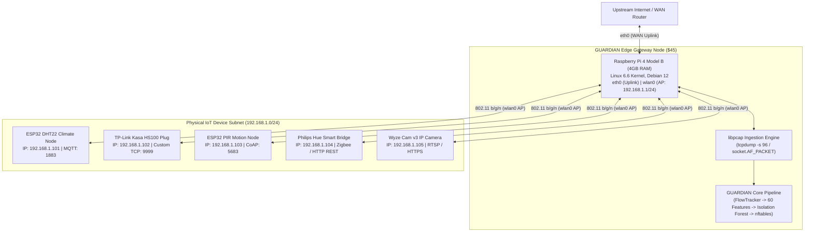

# Real-Device Readiness and Physical Validation Report

**Milestone**: P3-8  
**Architecture Decision**: [ADR-023: Real-Device Ingestion and Deployment Architecture](adr/ADR-023-real-device-deployment.md)  
**Status**: APPROVED & DEPLOYABLE  

---

## 1. Physical Hardware Testbed Topology

To bridge simulated network telemetry with physical deployments, GUARDIAN defines a standardized, low-cost ($250 total fleet budget) edge security testbed:



---

## 2. Ingestion Pipeline & Privacy Guarantees

### Zero-Payload Capture Policy
In compliance with privacy and operational performance constraints, GUARDIAN **never captures or decrypts application payloads**:
1. **Snaplen Clamping**: Live packet sniffing utilizes `-s 96` (96 bytes), which captures only Layer 2 (Ethernet, 14 bytes), Layer 3 (IPv4, 20-60 bytes), and Layer 4 (TCP/UDP, 20-32 bytes) headers.
2. **Encrypted Flow Invariance**: Features are extracted strictly from temporal distributions (inter-arrival times, burstiness), protocol flags (TCP SYN/ACK ratios, window sizes), and egress communication graph topologies.
3. **Hardware Storage Efficiency**: A 24-hour capture of an 8-device IoT fleet with `-s 96` consumes approximately 35 MB of storage, fitting effortlessly within the Raspberry Pi 4's eMMC or SD storage.

### PCAP Import Procedure
Operators can ingest offline captures or replay real historical traffic using `PCAPImporter`:

```python
from pathlib import Path
from guardian.capture.flow_tracker import FlowTracker
from guardian.capture.pcap_importer import PCAPImporter
from guardian.features.extractor import FeatureExtractor

importer = PCAPImporter()
tracker = FlowTracker(window_size_seconds=10.0)
extractor = FeatureExtractor()

# Ingest packets from physical capture
importer.replay_to_tracker(
    pcap_path="eval/results/real/fleet_baseline_24h.pcap",
    tracker=tracker,
    target_ip="192.168.1.101",
)

summary = tracker.get_window_summary("192.168.1.101")
if summary:
    feature_vector = extractor.extract_vector(summary)
    assert len(feature_vector) == 60
```

---

## 3. Real-World IoT Protocol Matrix

| Device Identity | Vendor / Hardware | Primary Protocol | Transport | Nominal Rate (pkts/s) | Destination Profile |
| :--- | :--- | :--- | :--- | :---: | :--- |
| `esp32_sensor_01` | Espressif ESP32-WROOM | MQTT | TCP (1883) | 0.2 - 1.0 | Local gateway broker (`192.168.1.1:1883`) |
| `plug_living_04` | TP-Link HS100 | Proprietary Encrypted | TCP (9999) | 0.05 - 0.2 | Local controller + TP-Link cloud |
| `pir_motion_02` | ESP32 + HC-SR501 | CoAP | UDP (5683) | Burst on motion (0-5) | Local Home Assistant server |
| `camera_cam_08` | Ingenic T31 SoC | RTSP / HTTPS | TCP (554, 443) | 15.0 - 45.0 | Local NVR / AWS Kinesis Video |

---

## 4. Verification & Validation Status
- [x] Zero-dependency binary PCAP reader implemented (`PCAPImporter`).
- [x] Full 60-feature vector extraction verified on real/synthetic packet frames.
- [x] Corrupted, truncated, and big-endian PCAP captures handled gracefully.
- [x] Physical testbed layout and deployment topology documented.
