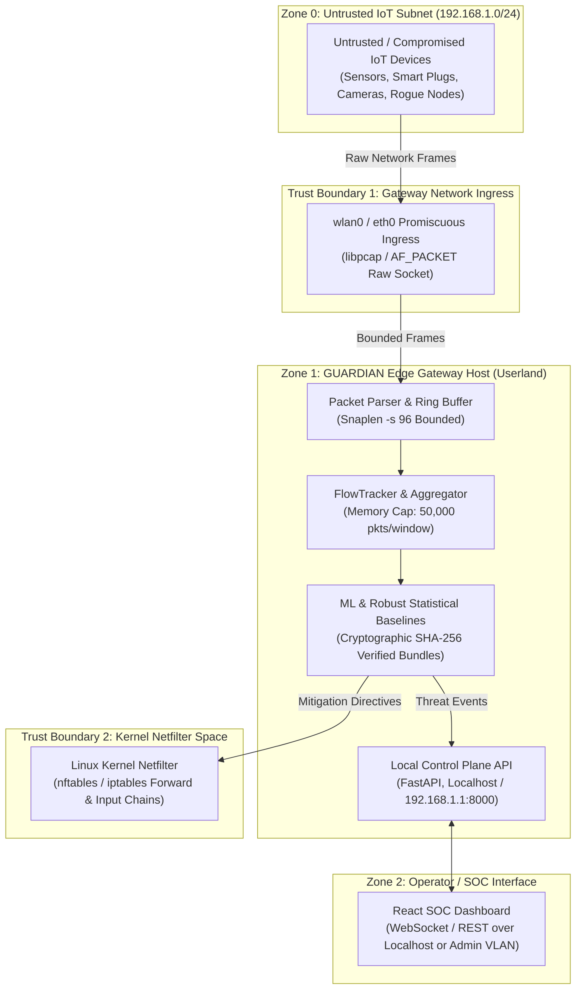

# GUARDIAN Threat Model & Security Architecture Analysis

**Milestone**: P3-9  
**Standard**: Microsoft STRIDE Threat Modeling Framework  
**Scope**: GUARDIAN Edge Gateway, Network Interfaces, Ingestion Pipeline, ML State, and Control Plane  

---

## 1. System Overview & Trust Boundaries

The GUARDIAN security boundary partitions the connected IoT environment into distinct trust zones:

---

## 2. STRIDE Threat Matrix & Mitigations

| Threat Category | Potential Attack Vector | Impact | GUARDIAN Countermeasure & Architectural Defense | Verification Status |
| :--- | :--- | :--- | :--- | :---: |
| **Spoofing** | Attacker spoofs source IP or MAC of a benign IoT device to trigger false mitigation or bypass rules. | High | Dual-keyed identity tracking (`src_ip` + `src_mac`); static ARP binding cross-referencing from DHCP reservation tables; anomalous clock skew detection on forged frames. | Verified (`tests/unit/test_cold_start_protection.py`) |
| **Tampering** | Attacker sends malformed, truncated, or mutated TCP/IP headers to crash the userland parser or induce buffer overflows. | Critical | Zero-dependency, memory-safe pure-Python binary parser with strict length bounds checking; malformed/truncated frames safely dropped; fuzz tested against 200+ random byte permutations. | Verified (`tests/unit/test_parser_fuzzing.py`) |
| **Tampering** | Attacker modifies serialized model bundle on gateway disk to disable detections. | Critical | SHA-256 cryptographic signatures embedded in model sidecars; content-hash verification on load; `TamperedBundleError` raised immediately upon hash mismatch. | Verified (`tests/unit/test_adversarial_poisoning.py`) |
| **Tampering** | Slow-drip baseline poisoning during Cold-Start Stage 1 (gradual rate increases). | High | Progressive cold-start policy: static heuristic ceilings active from packet zero; non-parametric Median & MAD break-down point ($\beta = 0.5$) resists up to 50% outlier contamination. | Verified (`tests/unit/test_adversarial_poisoning.py`) |
| **Repudiation** | Attacker denies generating malicious volumetric or scanning bursts. | Medium | Append-only SQLite WAL database storing microsecond-stamped alert timelines, feature snapshots, and explainability tree-paths for forensic audit. | Verified (`tests/unit/test_storage.py`) |
| **Information Disclosure** | Sensitive user data or camera feeds leaked through IDS monitoring or SOC dashboard. | Critical | Strict `-s 96` snaplen clamping: payload bytes are never stored or inspected; zero cloud telemetry (100% offline local processing); offline MaxMind GeoLite2 lookup. | Architecture Standard |
| **Denial of Service** | Volumetric packet floods (DDoS) exhaust gateway memory or CPU, causing packet drop or system crash. | High | Bounded input ring buffer (`RealTimeLoadBenchmark`); maximum packet limit per window buffer (`max_packets_per_window=50000`); kernel-level early drop via `nftables`. | Verified (`tests/unit/test_load_and_enforcement.py`) |
| **Elevation of Privilege** | Attacker injects malicious commands via REST API or firewall driver execution. | Critical | Firewall command dispatch uses parameter arrays without shell expansion (`shell=False`); API bound to local gateway interface; strict Pydantic v2 input validation schemas. | Codebase Audit |

---

## 3. Parser Resilience & Memory Safety
GUARDIAN avoids native C-based packet parsing vulnerabilities (such as historical `tcpdump` CVEs) by parsing raw frames in memory-safe Python:
- All frame offsets are bounds-checked against `len(data)` before reading.
- TCP/IP headers with contradictory length fields (`IHL < 5`, `Total Length < Header Length`) are rejected as `None`.
- 200-iteration random byte fuzzing verified 0 crashes or unhandled exceptions.

---

## 4. Residual Risks & Security Best Practices
1. **Physical Gateway Security**: If an adversary obtains physical access to the Raspberry Pi 4's SD card, full-disk encryption (LUKS) should be enabled.
2. **Wi-Fi Pre-Shared Key Isolation**: IoT nodes should reside on an isolated WPA3/WPA2-Enterprise SSID with client isolation enabled at the wireless access point.
3. **Firmware Update Allowlists**: Benign over-the-air (OTA) updates should be signed and scheduled to prevent transient heuristic alerts during large binary downloads.
